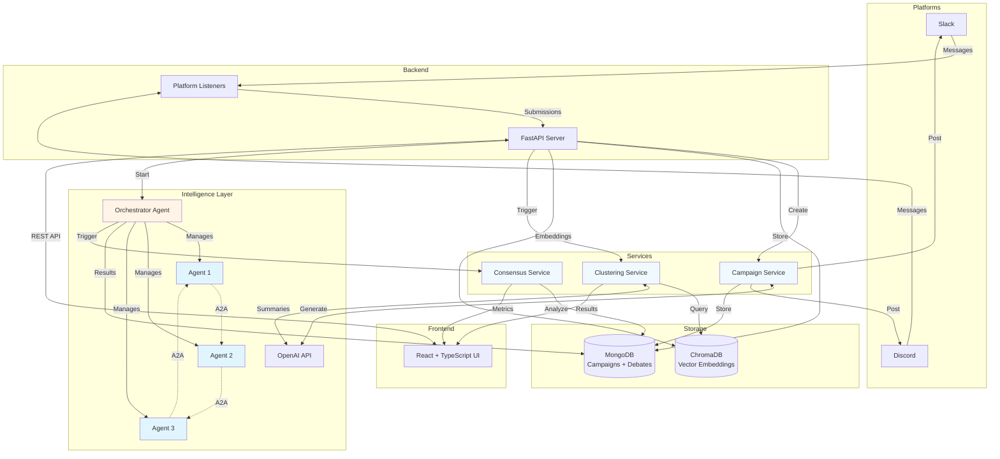

# Harmony

An intelligent platform that transforms community opinions into **intelligence** through clustering, A2A simulation, and consensus analysis.

## Features

### Ideation Intelligence Platform 
- **Campaign Management**: Create and launch ideation campaigns to collect community input from different sources. 
- **OAuth Authentication**: Secure Sources ingestion integration with automatic token management
- **Real-time Monitoring**: Live ingestion showing submissions as they arrive from connected platforms.

### Semantic Intelligence
- **Semantic Clustering**: Automatically cluster similar opinions and ideas using vector embeddings.

### A2A Communication
- **AI Debate and Conversation Simulation**: Run multi-agent debate simulations using A2A communication. The agents are dynamically created from k opinion clusters.
- **Consensus Assessment**: Calculate consensus scores, semantic alignment, and convergence metrics between agents during the live discussion. 

## Architecture



### Tech Stack

**Backend**: FastAPI • MongoDB • ChromaDB • OpenAI/CrewAI • Slack/Discord SDK  
**Frontend**: React + TypeScript • Vite • Tailwind CSS  
**Intelligence**: A2A Communication (Crew AI), Chroma DB clustering (bge-small-en-v1.5)

## Getting Started

### Prerequisites

- Docker

### Setup Instructions

**1. Configure Environment Variables**

Create a `.env` file in the `code` directory:

```bash
# OpenAI API Key (required for AI features)
OPENAI_API_KEY_HACK=your_openai_api_key

# Slack Integration (optional)
SLACK_CLIENT_ID=your_slack_client_id
SLACK_CLIENT_SECRET=your_slack_client_secret
SLACK_BOT_TOKEN=your_slack_bot_token
SLACK_APP_TOKEN=your_slack_app_token

# Discord Integration (optional)
DISCORD_CLIENT_ID=your_discord_client_id
DISCORD_CLIENT_SECRET=your_discord_client_secret
DISCORD_BOT_TOKEN=your_discord_bot_token
DISCORD_DEFAULT_CHANNEL_ID=your_discord_channel_id
```

**2. Start All Services**

```bash
cd code
docker-compose up --build
```

That's it! Docker Compose will orchestrate all services:
- **MongoDB**: `mongodb://localhost:27017`
- **Backend API**: `http://localhost:8000`
- **Frontend**: `http://localhost:8080`

## How It Works

1. **Create a Campaign** - Define your mission, connect data sources, kickstart your campaign with AI-generated messages
2. **Collect Submissions** - Posts campaign messages to platforms, monitors channels, stores submissions with embeddings
3. **Analyze Opinions** - Cluster the community inputs using embeddings, view AI-generated summaries 
4. **Run AI Debates** - Dynamically spawn AI agents representing the k-clusters, calculate consensus metrics and alignment scores during the live debate.

## API Endpoints

### Campaign Management

| Endpoint | Method | Description |
|----------|--------|-------------|
| `/suggest` | POST | Generate AI campaign suggestions |
| `/campaign` | POST | Launch a new campaign |
| `/campaigns` | GET | List all campaigns |

### Submissions & Clustering

| Endpoint | Method | Description |
|----------|--------|-------------|
| `/projects/{id}/submissions` | POST | Store submissions for a project |
| `/submissions` | GET | Get submissions by project |
| `/projects/{id}/clusters` | GET | Get semantic clusters |
| `/live-feed` | GET | Get real-time submission feed |

### Debate & Consensus

| Endpoint | Method | Description |
|----------|--------|-------------|
| `/projects/{id}/debates` | POST | Start a new debate |
| `/debates/{id}` | GET | Get debate details and messages |
| `/debates/{id}/consensus` | GET | Get consensus analysis |

See full API documentation at `http://localhost:8000/docs` when running.

## Project Structure

```
BaselHack/
├── code/
│   ├── backend/
│   │   ├── app/
│   │   │   ├── api/                          # API routes (main + OAuth endpoints)
│   │   │   ├── core/                         # Configuration & environment settings
│   │   │   ├── services/                     # Business logic layer
│   │   │   │   ├── ai_suggestions.py         # AI campaign generation
│   │   │   │   ├── clustering.py             # Semantic clustering with ChromaDB
│   │   │   │   ├── consensus_analysis.py     # Consensus metrics & alignment
│   │   │   │   ├── debate.py                 # Multi-agent debate orchestration
│   │   │   │   ├── *_storage.py              # MongoDB persistence (campaigns, debates)
│   │   │   │   ├── *_listener.py             # Platform listeners (Slack, Discord)
│   │   │   │   └── ...                       # OAuth, summarization, database, ...
│   │   │   ├── schemas/                      # Pydantic request/response models
│   │   │   └── main.py                       # FastAPI app initialization
│   │   ├── chroma_db/                        # ChromaDB persistent storage
│   │   ├── requirements.txt                  # Python dependencies
│   │   └── Dockerfile                        # Backend container config
│   ├── data/                                 # Runtime data (OAuth tokens)
│   ├── frontend/
│   │   ├── src/
│   │   │   ├── components/                   # React components
│   │   │   │   ├── ui/                       # shadcn/ui component library (40+ components)
│   │   │   │   ├── CampaignDesigner.tsx      # Campaign creation wizard
│   │   │   │   ├── DataSourceSelector.tsx    # Platform integration UI
│   │   │   │   ├── DebateSimulation.tsx      # Debate visualization
│   │   │   │   └── LiveDebateView.tsx        # Real-time debate display
│   │   │   ├── pages/                        # Main page views (Dashboard, ProjectDetail, etc.)
│   │   │   ├── hooks/                        # Custom React hooks
│   │   │   └── lib/                          # API client & utilities
│   │   ├── public/                           # Static assets (images, icons, logos)
│   │   ├── package.json                      # Node dependencies
│   │   ├── vite.config.ts                    # Build configuration
│   │   └── Dockerfile                        # Frontend container config
│   └── docker-compose.yml                    # Service orchestration (MongoDB + Backend + Frontend)
├── assets/                                   # Additional project assets
├── documentation/                            # Project documentation
└── README.md                                 # This file
```
