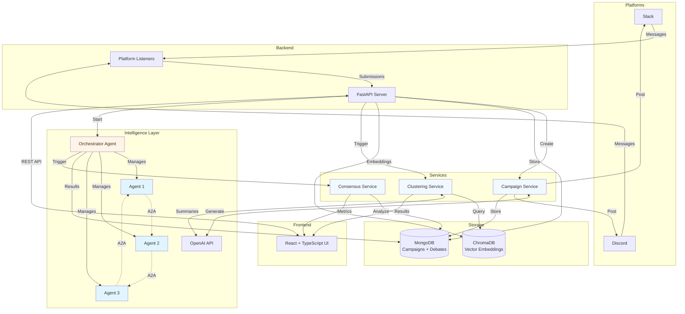

# Harmony

**Turning Chaos into Consensus: An AI-Powered Platform for Democratic Intelligence**

Harmony transforms fragmented community voices into actionable insights through semantic clustering, **Agent-to-Agent (A2A) simulation**, and real-time consensus analysis.

## Inspiration

In today's digital landscape, organizations struggle to make sense of scattered community feedback across platforms like Slack, Discord, and email. Traditional surveys and polls miss the nuance, while manual analysis doesn't scale. **What if we could automatically cluster similar ideas, then watch AI agents debate on behalf of these opinion groups to discover unexpected consensus?**

Harmony was born from this question: How do we democratize decision-making at scale while preserving the richness of diverse perspectives?

## Features

### Intelligent Campaign Orchestration
- **AI-Generated Campaigns**: Launch sophisticated ideation campaigns with AI-crafted prompts tailored to your mission
- **Multi-Platform Integration**: Seamlessly connect Slack, Discord, and other platforms with OAuth 2.0 security
- **Real-Time Stream Processing**: Watch submissions flow in live as your community engages across channels

### Semantic Intelligence Engine
- **Neural Clustering**: Leverage state-of-the-art vector embeddings (`bge-small-en-v1.5`) to automatically group similar opinions into meaningful clusters
- **Context-Aware Grouping**: Discover hidden patterns and themes that traditional keyword analysis would miss

### Agent-to-Agent (A2A) Simulation
- **Multi-Agent Orchestration**: Dynamically spawn AI agents, each representing a distinct opinion cluster from your community
- **Live Debate Visualization**: Watch AI agents engage in structured debates, building on each other's arguments in real-time
- **Consensus Analytics**: Track semantic alignment, convergence metrics, and consensus scores as the debate unfolds
- **Emergent Insights**: Discover unexpected common ground and novel solutions through agent interaction

## System Architecture



## Tech Stack


| Layer | Technologies |
|-------|-------------|
| **Backend** | Python, FastAPI, MongoDB, ChromaDB |
| **Frontend** | React + TypeScript, Vite, Tailwind CSS |
| **AI/ML** | OpenAI GPT-4, CrewAI (A2A Orchestration), BGE Embeddings (Semantic Search) |

## Getting Started

### Prerequisites

- Docker + Docker Compose

### Quick Start

**1. Configure Environment**

Create an `.env` file in the `code` directory:

```bash
# For local development
BASE_URL=http://localhost:8000

# OpenAI API Key (required for AI features)
OPENAI_API_KEY_HACK=your_openai_api_key

# Slack Integration (optional)
SLACK_CLIENT_ID=your_slack_client_id
SLACK_CLIENT_SECRET=your_slack_client_secret
SLACK_BOT_TOKEN=your_slack_bot_token
SLACK_APP_TOKEN=your_slack_app_token
SLACK_REDIRECT_URI=http://localhost:8000/oauth/slack/callback

# Discord Integration (optional)
DISCORD_CLIENT_ID=your_discord_client_id
DISCORD_CLIENT_SECRET=your_discord_client_secret
DISCORD_BOT_TOKEN=your_discord_bot_token
DISCORD_DEFAULT_CHANNEL_ID=your_discord_channel_id
DISCORD_REDIRECT_URI=http://localhost:8000/oauth/discord/callback

```

**2. Start Services**

```bash
cd code
docker-compose up --build
```

That's it! Docker Compose will orchestrate all services:
- **MongoDB**: `mongodb://localhost:27017`
- **Backend API**: `http://localhost:8000`
- **Frontend**: `http://localhost:8080`

## How It Works

1. **Launch Campaigns** - Define your mission with AI enhanced and engaging prompts, then auto-post to **various** channels
2. **Gather Intelligence** - Community members respond with messages in real-time. Each submission gets vectorized and stored with semantic embeddings
3. **Discover Patterns** - ChromaDB clusters similar opinions. AI summarizes each cluster theme with compelling visualization of the opinion landscape
4. **Retrieve Consensus** - Dynamically generate AI agents that debate in structured rounds. Retrieve consensus and find common ground

## API Endpoints

### Campaign Management

| Endpoint | Method | Description |
|----------|--------|-------------|
| `/suggest` | POST | Generate AI campaign suggestions |
| `/campaign` | POST | Launch a new campaign |
| `/campaigns` | GET | List all campaigns |

### Submissions & Clustering

| Endpoint | Method | Description |
|----------|--------|-------------|
| `/projects/{id}/submissions` | POST | Store submissions for a project |
| `/submissions` | GET | Get submissions by project |
| `/projects/{id}/clusters` | GET | Get semantic clusters |
| `/live-feed` | GET | Get real-time submission feed |

### Debate & Consensus

| Endpoint | Method | Description |
|----------|--------|-------------|
| `/projects/{id}/debates` | POST | Start a new debate |
| `/debates/{id}` | GET | Get debate details and messages |
| `/debates/{id}/consensus` | GET | Get consensus analysis |

See full API documentation at `http://localhost:8000/docs` when running.

## Project Structure

```
BaselHack/
├── code/
│   ├── backend/
│   │   ├── app/
│   │   │   ├── api/                          # API routes (main + OAuth endpoints)
│   │   │   ├── core/                         # Configuration & environment settings
│   │   │   ├── services/                     # Business logic layer
│   │   │   │   ├── ai_suggestions.py         # AI campaign generation
│   │   │   │   ├── clustering.py             # Semantic clustering with ChromaDB
│   │   │   │   ├── consensus_analysis.py     # Consensus metrics & alignment
│   │   │   │   ├── debate.py                 # Multi-agent debate orchestration
│   │   │   │   ├── *_storage.py              # MongoDB persistence (campaigns, debates)
│   │   │   │   ├── *_listener.py             # Platform listeners (Slack, Discord)
│   │   │   │   └── ...                       # OAuth, summarization, database, ...
│   │   │   ├── schemas/                      # Pydantic request/response models
│   │   │   └── main.py                       # FastAPI app initialization
│   │   ├── chroma_db/                        # ChromaDB persistent storage
│   │   ├── requirements.txt                  # Python dependencies
│   │   └── Dockerfile                        # Backend container config
│   ├── data/                                 # Runtime data (OAuth tokens)
│   ├── frontend/
│   │   ├── src/
│   │   │   ├── components/                   # React components
│   │   │   │   ├── ui/                       # shadcn/ui component library (40+ components)
│   │   │   │   ├── CampaignDesigner.tsx      # Campaign creation wizard
│   │   │   │   ├── DataSourceSelector.tsx    # Platform integration UI
│   │   │   │   ├── DebateSimulation.tsx      # Debate visualization
│   │   │   │   └── LiveDebateView.tsx        # Real-time debate display
│   │   │   ├── pages/                        # Main page views (Dashboard, ProjectDetail, etc.)
│   │   │   ├── hooks/                        # Custom React hooks
│   │   │   └── lib/                          # API client & utilities
│   │   ├── public/                           # Static assets (images, icons, logos)
│   │   ├── package.json                      # Node dependencies
│   │   ├── vite.config.ts                    # Build configuration
│   │   └── Dockerfile                        # Frontend container config
│   └── docker-compose.yml                    # Service orchestration (MongoDB + Backend + Frontend)
├── assets/                                   # Additional project assets
├── documentation/                            # Project documentation
└── README.md                                 # This file
```

---

## Built at Basel Hack 2025

Harmony represents our vision for the future of collective intelligence where technology amplifies human wisdom rather than replacing it.

*Made with ❤️ and lots of ☕*
