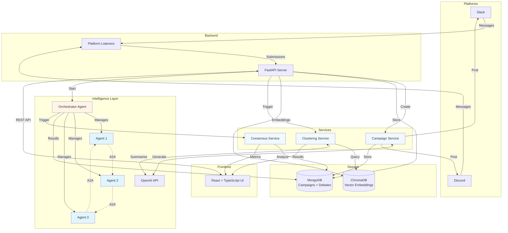

# Harmony

An intelligent platform that transforms community opinions into **collective intelligence** through AI-powered clustering, debate simulation, and consensus analysis.

## Features

### Semantic Intelligence
- **Semantic Clustering**: Automatically group similar opinions using AI embeddings and vector similarity
- **Vector Search**: ChromaDB-powered semantic search for finding similar opinions

### Multi-Agent AI
- **AI Debate Simulation**: Run multi-agent debates with agent-to-agent communication representing different opinion clusters
- **Consensus Analysis**: Calculate consensus scores, semantic alignment, and convergence metrics between agents

### Platform Integration
- **Campaign Management**: Create and launch campaigns to collect community input from Slack and Discord
- **Real-time Monitoring**: Live dashboard showing submissions as they arrive from connected platforms

## Architecture



### Tech Stack

**Backend**: FastAPI • MongoDB • ChromaDB • OpenAI/CrewAI • Slack/Discord SDK  
**Frontend**: React + TypeScript • Vite • Tailwind CSS • shadcn/ui  
**Intelligence**: Multi-agent debates with Agent-to-Agent (A2A) communication

## Getting Started

### Prerequisites

- Docker and Docker Compose
- Python 3.9+
- Node.js 18+

### Setup Instructions

**1. Install Backend Dependencies**

```bash
cd code/backend
python -m venv .venv
source .venv/bin/activate
pip install -r requirements.txt
```

**2. Install Frontend Dependencies**

```bash
cd code/frontend
npm install
```

**3. Configure Environment Variables**

Create a `.env` file in the `code` directory:

```bash
# OpenAI API Key (required for AI features)
OPENAI_API_KEY_HACK=your_openai_api_key

# Slack Integration (optional)
SLACK_CLIENT_ID=your_slack_client_id
SLACK_CLIENT_SECRET=your_slack_client_secret
SLACK_BOT_TOKEN=your_slack_bot_token
SLACK_APP_TOKEN=your_slack_app_token

# Discord Integration (optional)
DISCORD_CLIENT_ID=your_discord_client_id
DISCORD_CLIENT_SECRET=your_discord_client_secret
DISCORD_BOT_TOKEN=your_discord_bot_token
DISCORD_DEFAULT_CHANNEL_ID=your_discord_channel_id
```

**4. Start Backend Services (MongoDB + Backend API)**

```bash
cd code
docker-compose up --build
```

Backend API will be available at `http://localhost:8000`

**5. Start Frontend**

```bash
cd code/frontend
npm run dev
```

Frontend will be available at `http://localhost:5173`

## How It Works

1. **Create a Campaign** - Define your mission, connect data sources (Slack, Discord), design your campaign with AI-generated messages
2. **Collect Submissions** - Posts campaign messages to platforms, monitors channels, stores submissions with embeddings
3. **Analyze Opinions** - Cluster submissions by semantic similarity, view AI-generated summaries and statistics
4. **Run AI Debates** - Create AI agents representing clusters, calculate consensus metrics and alignment scores

## API Endpoints

### Campaign Management

| Endpoint | Method | Description |
|----------|--------|-------------|
| `/suggest` | POST | Generate AI campaign suggestions |
| `/campaign` | POST | Launch a new campaign |
| `/campaigns` | GET | List all campaigns |

### Submissions & Clustering

| Endpoint | Method | Description |
|----------|--------|-------------|
| `/projects/{id}/submissions` | POST | Store submissions for a project |
| `/submissions` | GET | Get submissions by project |
| `/projects/{id}/clusters` | GET | Get semantic clusters |
| `/live-feed` | GET | Get real-time submission feed |

### Debate & Consensus

| Endpoint | Method | Description |
|----------|--------|-------------|
| `/projects/{id}/debates` | POST | Start a new debate |
| `/debates/{id}` | GET | Get debate details and messages |
| `/debates/{id}/consensus` | GET | Get consensus analysis |

See full API documentation at `http://localhost:8000/docs` when running.

## Project Structure

```
BaselHack/
├── code/
│   ├── backend/
│   │   ├── app/
│   │   │   ├── api/              # API routes and OAuth
│   │   │   ├── core/             # Configuration
│   │   │   ├── services/         # Business logic
│   │   │   │   ├── clustering.py
│   │   │   │   ├── debate.py
│   │   │   │   ├── ai_suggestions.py
│   │   │   │   ├── slack_listener.py
│   │   │   │   └── discord_listener.py
│   │   │   └── schemas/          # Pydantic models
│   │   ├── requirements.txt
│   │   └── Dockerfile
│   ├── frontend/
│   │   ├── src/
│   │   │   ├── components/       # React components
│   │   │   ├── pages/            # Page components
│   │   │   └── lib/              # Utilities
│   │   └── package.json
│   └── docker-compose.yml
├── chroma_db/                    # Vector database storage
└── README.md
```
